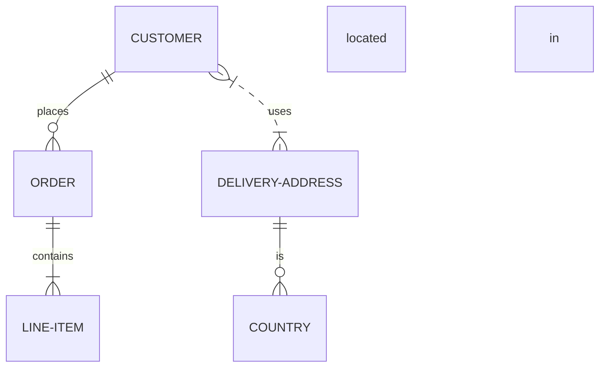

# Kroki Client 

Constroi o kroki-client usado no projeto [kroki-client-user](https://github.com/luizgsbraz/kroki-client-user)

A idéia é baixar direto do docker hub.

```mermaid
erDiagram
    CUSTOMER ||--o{ ORDER : places
    CUSTOMER }|..|{ DELIVERY-ADDRESS : uses
    ORDER ||--|{ LINE-ITEM : contains
    DELIVERY-ADDRESS ||--o{ COUNTRY : is located in
```